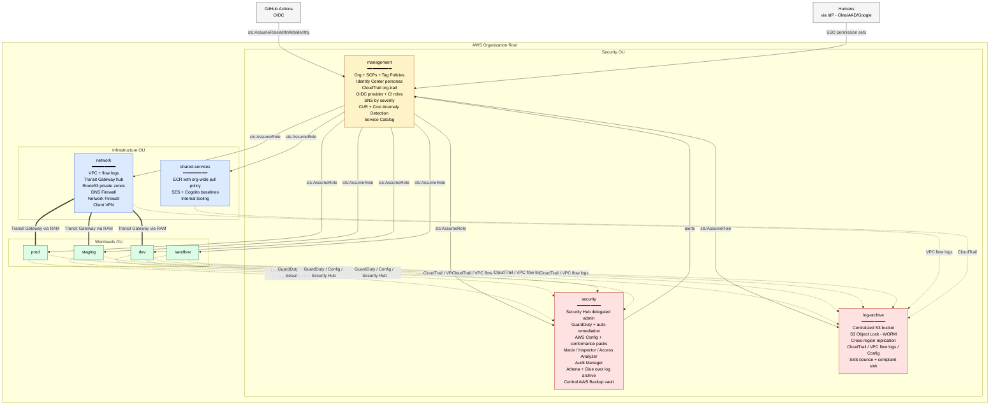

# Enterprise AWS Terraform Organization

Production-ready Terraform template for a complete enterprise AWS organization.
Covers CIS AWS Foundations, SOC 2, PCI-DSS, and HIPAA compliance by default.

## Architecture



**Legend** — yellow: management trust root · red: security/audit accounts · blue: shared infrastructure · green: workloads · solid arrows: IAM trust · dotted: telemetry/logging · double lines: network connectivity

## What's included

- **`modules/`** — 30+ reusable Terraform modules (no state)
- **`medium/`** — 10-account reference deployment
- **`large/`** — 30+ account reference deployment (with BU structure, account-vending, multi-region modules)
- **`bootstrap/`** — One-time state infrastructure setup
- **`policies/`** — Rego policies enforced via Conftest in CI
- **`.github/workflows/`** — Plan on PR, apply on merge, nightly drift detection, Conftest policy check

## Prerequisites

- Terraform >= 1.9
- AWS CLI configured with management account credentials
- GitHub repository (for OIDC trust)

## First-time setup

```bash
cd bootstrap
cp terraform.tfvars.example terraform.tfvars
# edit terraform.tfvars with your org name, region, management account ID
terraform init
terraform apply
terraform init -migrate-state  # migrate bootstrap state to S3
```

## Deploying accounts

Each account under `medium/accounts/<name>/` or `large/accounts/<name>/` is an
independent Terraform root. Deploy in dependency order:

```
management → log-archive → security → network → shared-services → workloads
```

See `docs/architecture.md` for the full dependency graph.

## Compliance

See `docs/compliance-matrix.md` for which controls each module implements
across CIS, SOC 2, PCI-DSS, and HIPAA.
