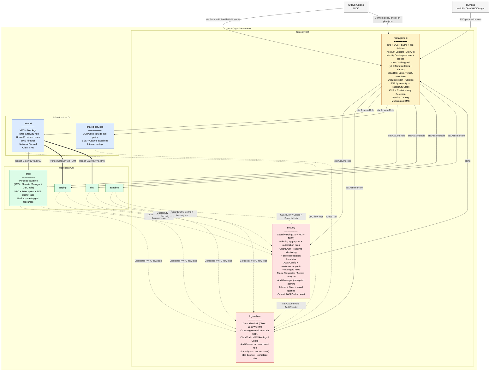

# Enterprise AWS Terraform Organization

Production-ready Terraform template for a complete enterprise AWS organization.
Covers CIS AWS Foundations, SOC 2, PCI-DSS, and HIPAA compliance by default.

## Architecture



**Legend** — yellow: management trust root · red: security/audit accounts · blue: shared infrastructure · green: workloads · solid arrows: IAM trust · dotted: telemetry/logging · double lines: network connectivity

## What's included

- **`modules/`** — 47 reusable Terraform modules (no state) — see catalog below
- **`medium/`** — 10-account reference deployment
- **`large/`** — 30+ account reference deployment (with BU structure, account-vending, multi-region modules)
- **`bootstrap/`** — One-time state infrastructure setup
- **`policies/`** — Rego policies enforced via Conftest in CI
- **`.github/workflows/`** — Plan on PR, apply on merge, nightly drift detection, Conftest policy check

## Module Catalog

### Foundation — org, accounts, state

| Module | Purpose |
|---|---|
| [`aws-organization`](modules/aws-organization) | AWS Organization + OUs, enable trusted service access |
| [`scp-policies`](modules/scp-policies) | 8 SCPs (deny root, deny leave-org, region allowlist, IMDSv2, S3 public block, deny IAM users, deny unencrypted storage, deny VPC changes) |
| [`tag-policies`](modules/tag-policies) | Organizations tag policy enforcing Environment / DataClass / ComplianceScope / CostCenter |
| [`account-baseline`](modules/account-baseline) | Per-account hardening: S3 block-public, EBS default encryption, IMDSv2 default, CIS password policy, budget alert |
| [`account-vending`](modules/account-vending) | Map-driven account creation via Organizations API with OU placement |
| [`workload-baseline`](modules/workload-baseline) | Composite for workload accounts: KMS + account-baseline + state-backend + secrets-baseline + GitHub OIDC CI role |
| [`state-backend`](modules/state-backend) | Per-account S3 + DynamoDB for Terraform state |
| [`kms`](modules/kms) | KMS key with rotation, configurable admins/users, alias, key_usage + customer_master_key_spec for asymmetric keys |
| [`kms-multi-region`](modules/kms-multi-region) | Multi-region KMS: primary + replica with matching alias in both regions (enables seamless cross-region S3 replication) |

### Identity & access

| Module | Purpose |
|---|---|
| [`identity-center`](modules/identity-center) | IAM Identity Center: 5 managed permission sets + custom persona sets + SSO groups + account assignments with GROUP resolution |

### Security services

| Module | Purpose |
|---|---|
| [`cloudtrail`](modules/cloudtrail) | Org-wide multi-region trail with log file validation, S3+Lambda data events, ApiCall+ApiError Insights, CW Logs delivery, 15 CIS metric filters + alarms, EventBridge auto-remediation rules |
| [`cloudtrail-lake`](modules/cloudtrail-lake) | CloudTrail Lake Event Data Store with 7-year retention, SQL-queryable, optional S3/Lambda data event capture |
| [`aws-config`](modules/aws-config) | Config recorder + org aggregator + CIS / PCI-DSS / HIPAA / NIST conformance packs |
| [`security-hub`](modules/security-hub) | Security Hub with CIS v3, PCI-DSS, NIST 800-53 standards |
| [`guardduty`](modules/guardduty) | Org-wide GuardDuty with all detection features (S3, EKS, EBS malware, RDS, Lambda) |
| [`guardduty-auto-remediation`](modules/guardduty-auto-remediation) | EventBridge severity routing + Lambda auto-quarantine for high-confidence findings |
| [`macie`](modules/macie) | Org-wide Macie for PII / sensitive data discovery |
| [`inspector`](modules/inspector) | Org-wide Inspector v2 (EC2 / ECR / Lambda / Lambda code) |
| [`access-analyzer`](modules/access-analyzer) | Org-wide IAM Access Analyzer |
| [`audit-manager`](modules/audit-manager) | Org-wide Audit Manager delegated admin |

### Logging & observability

| Module | Purpose |
|---|---|
| [`log-archive-bucket`](modules/log-archive-bucket) | Centralized log S3 bucket with Object Lock (WORM), versioning, KMS-SSE, optional cross-region replication |
| [`log-querying`](modules/log-querying) | Athena workgroup + Glue tables over CloudTrail and VPC flow logs |
| [`notifications`](modules/notifications) | SNS topics per severity (critical/high/medium/low/info) + EventBridge bus + 365-day archive + Chatbot scaffolding |

### Networking

| Module | Purpose |
|---|---|
| [`vpc`](modules/vpc) | 3-tier VPC (public/private/isolated) with flow logs to S3, gateway endpoints (S3, DynamoDB), 10 interface endpoints |
| [`route53`](modules/route53) | Private hosted zone associated with a VPC |
| [`tgw-hub`](modules/tgw-hub) | Transit Gateway hub with RAM resource share |
| [`tgw-spoke`](modules/tgw-spoke) | VPC attachment to a shared TGW |
| [`tgw-peering`](modules/tgw-peering) | Cross-region TGW peering for multi-region active-active |
| [`network-firewall`](modules/network-firewall) | AWS Network Firewall with stateful domain allowlist + AWS-managed threat-intel rule groups |
| [`dns-firewall`](modules/dns-firewall) | Route53 Resolver DNS Firewall with custom + AWS-managed domain lists |
| [`client-vpn`](modules/client-vpn) | Workforce VPN with SAML federation or mutual cert auth, split tunneling |
| [`session-manager`](modules/session-manager) | SSH-free EC2 access with S3 + CloudWatch session logging |
| [`waf-baseline`](modules/waf-baseline) | WAFv2 ACL with 5 AWS managed rule groups + rate limiting + optional Shield Advanced |

### Compute

| Module | Purpose |
|---|---|
| [`ecs-cluster`](modules/ecs-cluster) | Fargate cluster with Container Insights + ECS Exec with KMS-encrypted logs |
| [`eks-cluster`](modules/eks-cluster) | EKS with private endpoint, envelope-encrypted secrets, all control-plane logs, managed node group |
| [`lambda-baseline`](modules/lambda-baseline) | ARM64 Lambda with X-Ray, KMS log encryption, optional VPC + DLQ |

### Databases

| Module | Purpose |
|---|---|
| [`rds-baseline`](modules/rds-baseline) | RDS Postgres/MySQL with enforced TLS, audit logs, Secrets Manager-managed password, Performance Insights |
| [`aurora-baseline`](modules/aurora-baseline) | Aurora cluster (Postgres/MySQL) with the same compliance guarantees |
| [`aurora-global`](modules/aurora-global) | Aurora Global Database spanning primary + secondary regions |
| [`dynamodb-baseline`](modules/dynamodb-baseline) | DynamoDB with SSE-KMS, PITR, deletion protection, optional streams + TTL |

### Application services

| Module | Purpose |
|---|---|
| [`cognito-baseline`](modules/cognito-baseline) | User pool with mandatory MFA, advanced security ENFORCED, 14-char password policy |
| [`ses-baseline`](modules/ses-baseline) | SESv2 with auto-DKIM, custom MAIL FROM + SPF, DMARC, bounce/complaint SNS routing |

### Resilience & governance

| Module | Purpose |
|---|---|
| [`aws-backup`](modules/aws-backup) | Central backup vault with Vault Lock, daily/weekly/monthly plans, tag-based selection, cross-region copy |
| [`chaos-engineering`](modules/chaos-engineering) | AWS FIS experiment templates (EC2 stop, AZ blackhole, RDS failover) with CloudWatch stop conditions |
| [`cost-management`](modules/cost-management) | Cost & Usage Report + Cost Anomaly Detection + org-wide monthly budget |
| [`secrets-baseline`](modules/secrets-baseline) | Per-account Secrets Manager KMS key + rotation Lambda IAM + unrotated-secret Config rule |
| [`service-catalog`](modules/service-catalog) | Service Catalog portfolio + CloudFormation products + principal associations for developer self-service |

## Prerequisites

- Terraform >= 1.9
- AWS CLI configured with management account credentials
- GitHub repository (for OIDC trust)
- AWS provider 5.x (pinned via `~> 5.0` in every module — see [Provider pinning](#provider-pinning))

## Local developer setup

The repo ships pre-commit hooks and a set of CI gates that you can run
locally before pushing.

```bash
# Install the tools (macOS - adjust for your OS)
brew install terraform terraform-docs pre-commit checkov
brew install terraform-linters/tap/tflint   # arm64 macs: arch -arm64 brew install ...
arch -arm64 brew install tfsec              # arm64 macs

# Initialize pre-commit hooks - runs fmt/validate/tflint/docs/checkov on every commit
pre-commit install

# Sanity-check the toolchain
terraform fmt -check -recursive
tflint --init
./scripts/generate-module-docs.sh
```

### Running CI gates locally

| Gate | Command |
|---|---|
| Format | `terraform fmt -check -recursive` |
| Validate one module | `cd modules/<name> && terraform init -backend=false && terraform validate` |
| Lint one module | `tflint --chdir=modules/<name> --config="$PWD/.tflint.hcl"` |
| Security scan (tfsec) | `tfsec modules` |
| Security scan (checkov) | `checkov -d modules --config-file .checkov.yml` |
| Module unit tests | `cd modules/<name> && terraform test` |
| Conftest policies | `conftest test plan.json --policy ./policies/` (after a `terraform show -json`) |

## Provider pinning

Every module pins the AWS provider to `~> 5.0` (>= 5.0, < 6.0). This:

- Permits any 5.x minor/patch upgrade (bug fixes, new resources)
- Blocks the next major (e.g., 6.x), which historically introduces breaking changes
- Tested against AWS provider 5.x throughout

If you need to test against 6.x, edit `modules/*/versions.tf` and adjust the
constraint. Several attribute renames between 5.x → 6.x affect this template
(`data.aws_region.current.name` → `.region`, `aws_securityhub_finding_aggregator.id` → `.arn`).
The compatibility audit is tracked in `docs/multi-region-strategy.md`.

## End-to-end example

See [`examples/sample-workload-ecs/`](examples/sample-workload-ecs) — a
complete deployment using `workload-baseline` + `vpc` + `ecs-cluster` +
`aurora-baseline` + `waf-baseline` to run a containerized app behind an
HTTPS ALB with managed credentials and central backup tagging.

## First-time setup

```bash
cd bootstrap
cp terraform.tfvars.example terraform.tfvars
# edit terraform.tfvars with your org name, region, management account ID
terraform init
terraform apply
terraform init -migrate-state  # migrate bootstrap state to S3
```

## Deploying accounts

Each account under `medium/accounts/<name>/` or `large/accounts/<name>/` is an
independent Terraform root. Deploy in dependency order:

```
management → log-archive → security → network → shared-services → workloads
```

See `docs/architecture.md` for the full dependency graph.

## Compliance

See `docs/compliance-matrix.md` for which controls each module implements
across CIS, SOC 2, PCI-DSS, and HIPAA.

## Operations docs

| Document | When to read it |
|---|---|
| [`docs/architecture.md`](docs/architecture.md) | Understanding the overall layout + deployment dependency graph |
| [`docs/onboarding.md`](docs/onboarding.md) | Greenfield setup, end-to-end |
| [`docs/access-management.md`](docs/access-management.md) | Personas, SSO groups, break-glass, onboarding humans |
| [`docs/compliance-matrix.md`](docs/compliance-matrix.md) | Audit evidence — which control maps to which module |
| [`docs/multi-region-strategy.md`](docs/multi-region-strategy.md) | Designing for cross-region resilience |
| [`docs/migration-from-existing-org.md`](docs/migration-from-existing-org.md) | **Bringing an existing AWS Org into this template** — 8–12 week phased plan |
| [`docs/disaster-recovery-runbook.md`](docs/disaster-recovery-runbook.md) | **Concrete step-by-step procedures** for Aurora failover, log archive recovery, region outage, compromised credentials, etc. |
| [`docs/cost-analysis.md`](docs/cost-analysis.md) | **Itemized monthly cost breakdown** at medium and large scale, with the levers that drive cost up |
