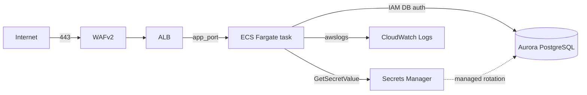

# Sample Workload: Containerized App on ECS Fargate

End-to-end example showing how to compose the modules in this repo into a
real production application. Deploys:

- **VPC** (3-tier subnets, flow logs to log-archive, gateway + interface endpoints, EKS-ready subnet tags)
- **Workload baseline** (KMS, Secrets Manager rotation Lambda role, state-backend, GitHub OIDC CI role)
- **ECS Fargate cluster** (enhanced Container Insights, ECS Exec with KMS-encrypted shell logs)
- **Aurora PostgreSQL** (managed master password in Secrets Manager, IAM DB auth, multi-AZ)
- **ALB + HTTPS listener + WAFv2** (5 AWS managed rule groups + rate limit + ALB access logs to log-archive)
- **ECS task definition + service** (ARM64, readonly rootfs, awsvpc networking, circuit breaker rollback)
- **AWS Backup integration** (task definition tagged `Backup=true` for automatic inclusion in the central backup plan)



## Prerequisites

You need these from an already-deployed account that ran the management +
log-archive + security + network + workload-baseline modules:

| Input | Source |
|---|---|
| `log_archive_bucket_arn` / `log_archive_bucket_name` | `terraform output -raw` in the log-archive root |
| `account_id` | The 12-digit ID of the workload account |
| `acm_certificate_arn` | An ACM cert covering `var.domain_name` (you provision this separately) |
| `app_image` | An ECR image already pushed (e.g., via your CI pipeline) |
| GitHub OIDC role | Already created by `workload-baseline` in the management account |

## Deploy

```bash
cd examples/sample-workload-ecs
cp terraform.tfvars.example terraform.tfvars
# Edit terraform.tfvars with real values
terraform init
terraform plan
terraform apply
```

After apply:

1. Get the ALB DNS name: `terraform output -raw alb_dns_name`
2. Create a Route53 alias record: `var.domain_name` → ALB DNS name + zone ID
3. Browse to `https://<your-domain>/healthz` — should return 200

## What this example demonstrates

- **Composition pattern**: how modules layer (baseline → network → compute → data)
- **Secret flow**: Aurora master password → Secrets Manager → ECS task `secrets:` env (never plaintext in task def)
- **IAM least privilege**: task role gets `rds-db:connect` scoped to the specific cluster + user, nothing else
- **Backup tagging**: a single `Backup = true` tag on the task definition + Aurora cluster opts them into the central backup plan
- **Defense in depth**: WAF + ALB security group (HTTPS-only, drop_invalid_header_fields) + ECS SG (ALB-only ingress)
- **Operational ergonomics**: ECS Exec for ops shell, circuit breaker for rollback, log groups KMS-encrypted

## What this example does NOT demonstrate (and why)

- **Multi-region**: see `docs/multi-region-strategy.md`. Single-region is enough to show the composition pattern.
- **Blue/green deploys**: requires CodeDeploy + an integration with the ECS service; out of scope for the baseline example.
- **Autoscaling**: depends entirely on your app's traffic shape; trivially added via `aws_appautoscaling_target` + policies.
- **DNS automation**: Route53 alias creation should happen in the account that owns the hosted zone; that account is upstream.

## Customizing

The example is intentionally < 250 lines of HCL. To fork it for a real app:

1. Copy the directory to your application repo
2. Change `app_name`, `app_image`, `app_port`
3. Adjust `app_cpu` / `app_memory` based on load testing
4. Add per-app IAM permissions to `aws_iam_role_policy "task_*"`
5. Wire your CI to push images to ECR and run `terraform apply` via the existing OIDC role
